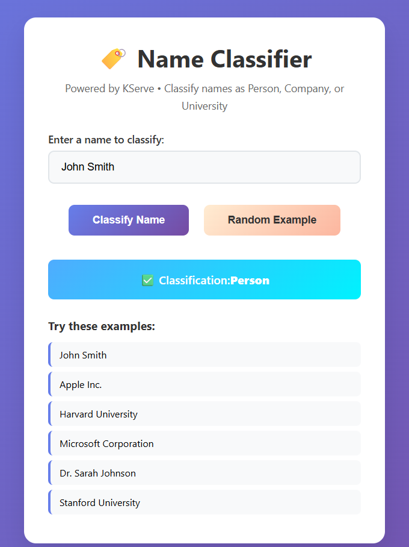

# Name Classifier - KServe V2 Inference Server

A KServe-compliant HTTP API for classifying full names into one of three categories: `Person`, `Company`, or `University`.

🌐 **[Try it here](http://3.136.23.88:8000/)** - Live demo of the deployed classifier



## Project Overview

This project implements a production-ready KServe V2 inference server that classifies names. The server loads a trained champion machine learning model selected via an internal model registry.

### Architecture

- **Framework**: KServe Python SDK (v0.13.0)
- **Protocol**: KServe V2 Inference Protocol (REST)
- **Containerization**: Docker + Docker Compose
- **Python Version**: 3.11

### Classification Categories

- `Person` - Individual names (e.g., "Bob Immerman", "Dr. Jane Smith")
- `Company` - Business entities (e.g., "Microsoft Corporation", "Acme Inc.")
- `University` - Educational institutions (e.g., "Harvard University", "MIT")

## Quick Start

### Using Make

This project includes a Makefile for easy command execution:

```bash
# See all available commands
make help

# Install dependencies
make install

# Start server with Docker (builds and runs)
make start

# Stop Docker containers
make stop

# Restart containers
make restart

# View logs
make logs

# Check status
make status

# Train model with embeddings (Docker)
make train-docker

# Test AWS EC2 deployment
make test-aws
```

> **Note**: For more detailed documentation on the project's architecture, modeling approach, and deployment, see the `docs/` folder.

## API Usage

### Inference (Name Classification)

make test-aws

```bash
curl -X POST http://3.136.23.88:8000/v2/models/name-classifier/infer \
  -H "Content-Type: application/json" \
  -d '{
    "inputs": [
      {
        "name": "name",
        "shape": [1],
        "datatype": "BYTES",
        "data": ["Bob Immerman"]
      }
    ]
  }'
```

**Response**:
```json
{
  "model_name": "name-classifier",
  "model_version": null,
  "id": "",
  "parameters": null,
  "outputs": [
    {
      "name": "classification",
      "shape": [1],
      "datatype": "BYTES",
      "parameters": null,
      "data": ["Person"]
    }
  ]
}
```