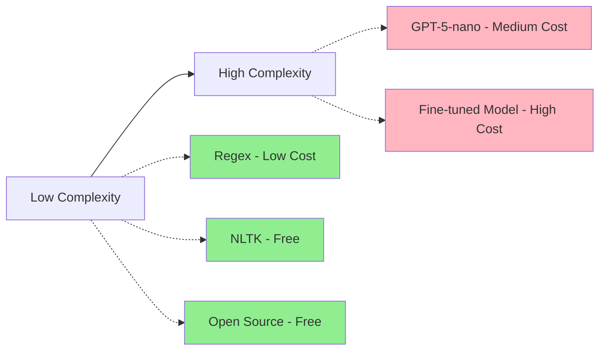
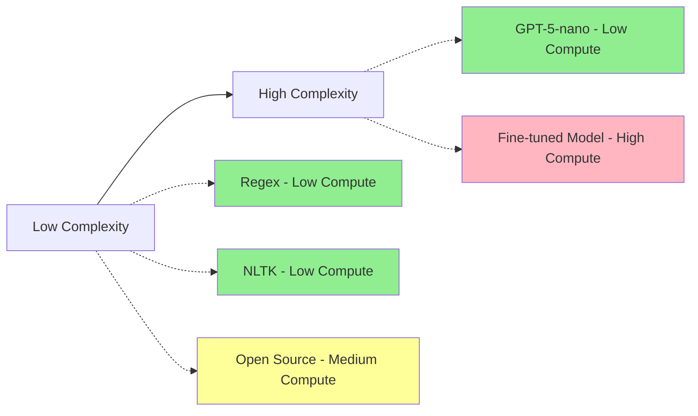
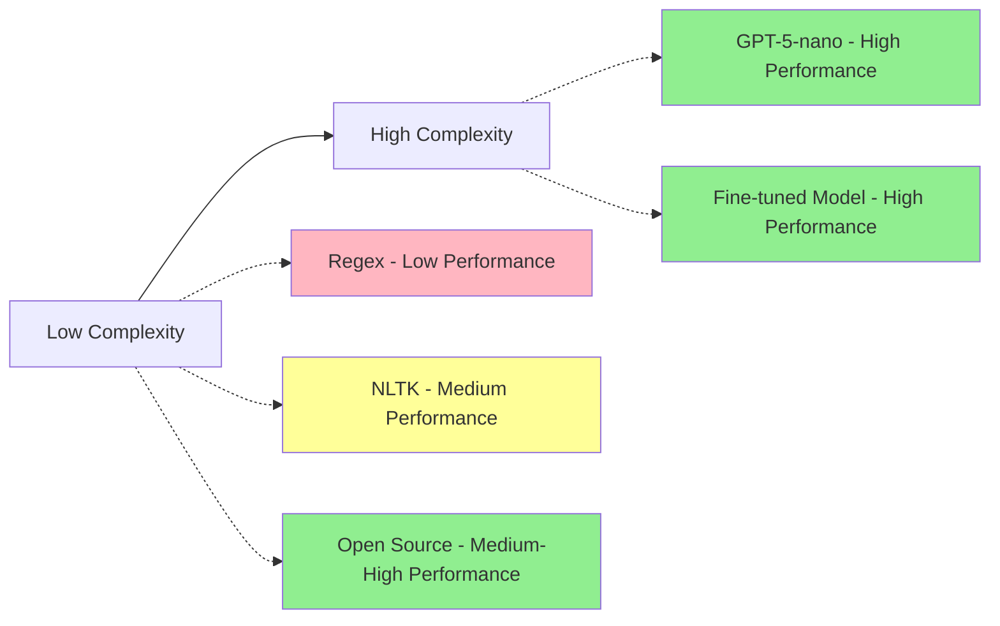
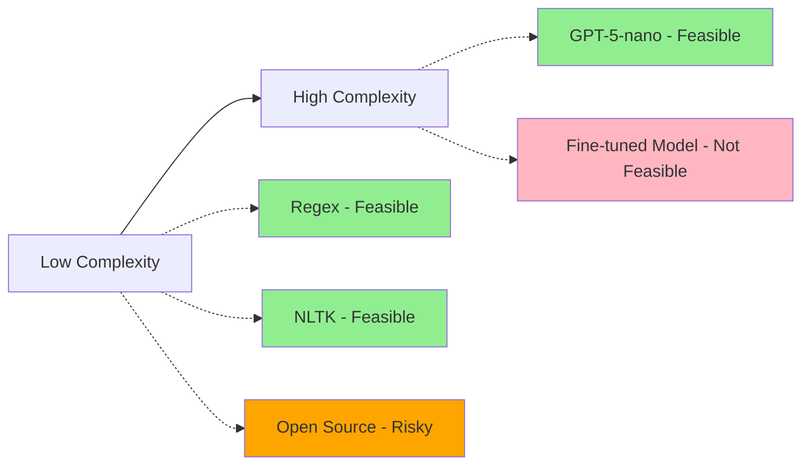

# 1. Thought Process

## Time Management Strategy

When I first received the briefing for this project, my immediate thought was: **"How do I manage my time effectively because I want to respect the 4-hour limit and also consider it as a challenge to myself to only do it in 4 hours?"**

This time constraint became a key driver in my decision-making process throughout the project.

### Learning Phase (45 minutes)

The first thing I did was spend a good amount of time, maybe 45 minutes, just reading about KServe, doing some tutorials, so that I could get a hang of what I need to do. This was crucial because:

- KServe was the part of the project I was most unfamiliar with
- Understanding the infrastructure requirements upfront would prevent costly mistakes later
- Getting the protocol right from the start would save time on debugging

### Build-First Approach

The second key decision I made was: **"I'm rather going to build a bad version of this workflow end-to-end and iterate from there."**

This approach was chosen because:
- If I can get a bad version working end-to-end, then it would be quite easy for me to iterate on the data science side of things
- I'm much more comfortable improving my data science approach once the infrastructure is in place
- This reduces the risk of getting stuck on complex ML problems while the clock is ticking
- It allows for rapid prototyping and validation of the overall system architecture

## Data Science Solution Trade-offs

When thinking about how to solve the data science part of this project, I recognized there are many ways to approach name classification. My first thought was that an LLM could easily do this, but then I thought: **"Is there not a cheaper way to do this? You probably don't want to incur cost unnecessarily if you're doing this in production."**

I identified several key trade-offs to consider:

### 1. Complexity of the Solution
- Simple solutions are easier to implement and debug
- Complex solutions may offer better performance but require more development time
- Given the 4-hour constraint, complexity becomes a significant factor

### 2. Cost of the Solution
- API calls to external services have ongoing costs
- Self-hosted solutions have infrastructure costs
- Training custom models has computational costs
- Production deployment considerations

### 3. Intensiveness of the Compute
- You could train your own model to classify this, but then the infrastructure requirements would be higher
- Real-time vs batch processing requirements
- Scalability considerations for production use

### 4. Performance of the Model
- Accuracy vs speed trade-offs
- False positive/negative rates
- Confidence scoring capabilities

## Solution Options Considered

With these trade-offs in mind, I came up with several approaches to solve the name classification problem:

### 1. LLM Approach (GPT-5-nano)
**Pros:**
- Very easy to implement
- High accuracy out of the box
- Fast development time
- Good for experimentation

**Cons:**
- Ongoing API costs
- External dependency
- Potential latency issues
- Less control over the model

**Use Case:** Quick prototyping and proof of concept

### 2. Traditional NLP (NLTK)
**Pros:**
- Free to use
- No external dependencies
- Good for named entity recognition
- Well-established library

**Cons:**
- May not be specifically trained for this task
- Limited customization options
- Potentially lower accuracy for this specific use case

**Use Case:** When you want a free, self-contained solution

### 3. Regex-Based Approach
**Pros:**
- Very fast
- No external dependencies
- Complete control over logic
- Easy to understand and debug

**Cons:**
- High risk of false negatives and false positives
- Company names and people's names can be quite similar
- Difficult to maintain as requirements evolve
- Brittle to edge cases

**Use Case:** When you have very specific, well-defined patterns

### 4. Fine-tuned Small Language Model
**Pros:**
- Can be optimized for this specific task
- Good balance of performance and cost
- No ongoing API costs once trained
- Can be deployed locally

**Cons:**
- Requires training time and data
- More complex infrastructure
- Need to manage model updates
- Higher initial development cost

**Use Case:** When you have sufficient training data and time for model development

### 5. Open Source Solutions
**Pros:**
- Leverage existing work
- Often well-tested and documented
- Community support
- Can be customized

**Cons:**
- May not fit exact requirements
- Dependency on external projects
- Potential licensing issues
- May require significant adaptation

**Use Case:** When there's a good existing solution that can be adapted

## Trade-off Analysis

### Complexity vs Cost

### Complexity vs Compute Intensity

### Complexity vs Performance

### 4-Hour Time Constraint Analysis

## Decision Framework

Given the 4-hour time constraint and the need to build an end-to-end system, I prioritized:

1. **Speed of implementation** - Get something working quickly
2. **End-to-end functionality** - Ensure the complete pipeline works
3. **Iteration capability** - Make it easy to improve the ML component later
4. **Production readiness** - Build with deployment in mind

This led me to start with a simple random classifier as a placeholder, ensuring the KServe infrastructure works perfectly, and then plan to iterate on the ML model in subsequent phases.

## Next Steps

The thought process document sets the foundation for understanding:
- Why certain technical decisions were made
- How time constraints influenced the approach
- What trade-offs were considered
- How the solution can be iteratively improved

This approach allows for rapid initial development while maintaining a clear path for future enhancements.

